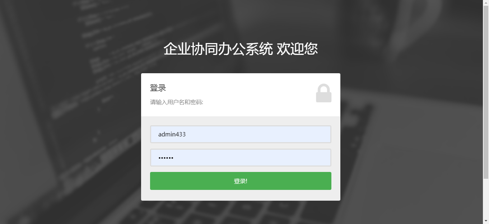
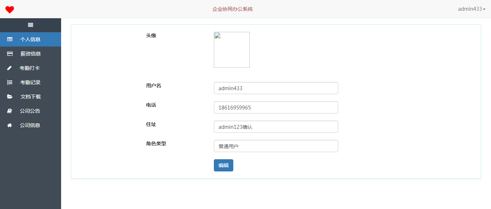
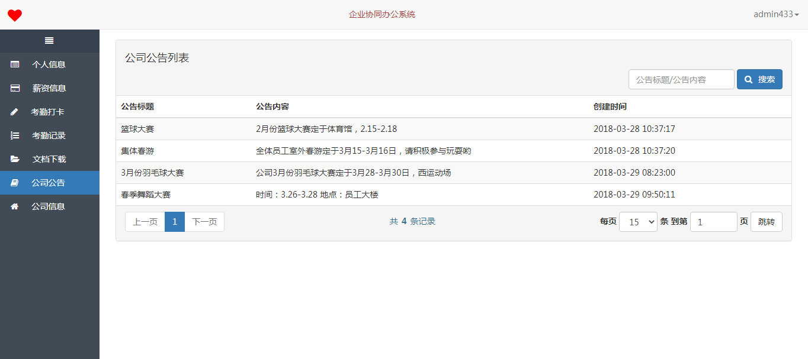
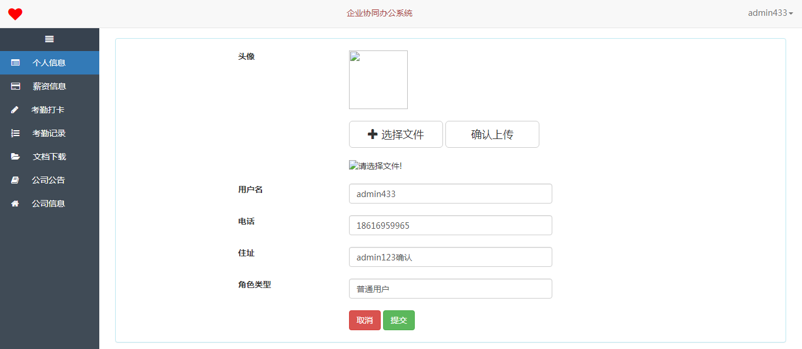
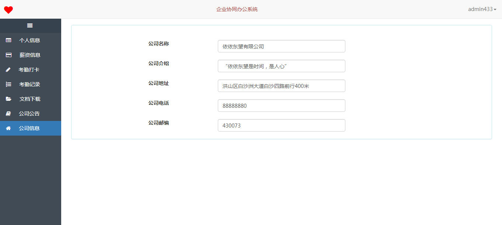
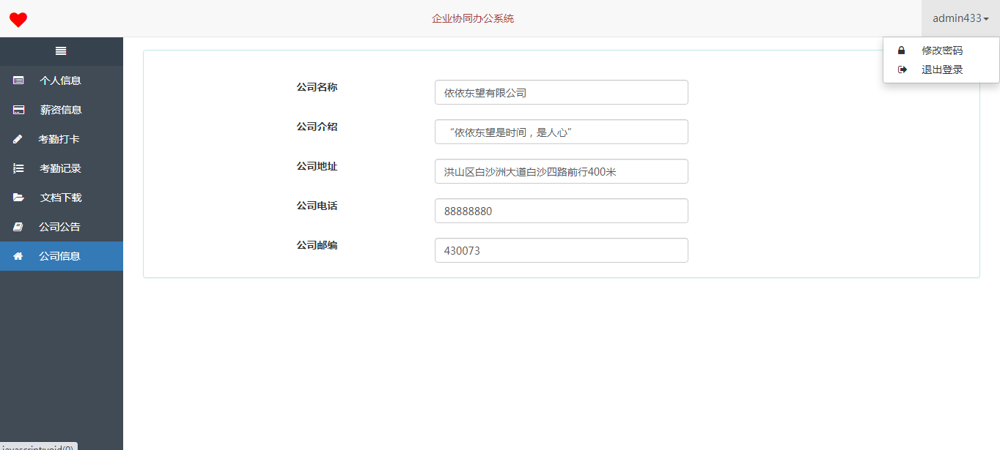

<h1 align="center">企业协同办公系统</h1>

## 简介
企业协同办公系统：角色分为管理员、用户；功能包括个人信息管理、薪资与考勤记录、公司公告、任务管理、日程安排、文档共享、即时通讯。    --计算机毕业设计源码；毕设源码；java毕业设计源码

## 联系方式

<h3 align="center">获取完整代码与数据库文件 + 微信：bysj5151 QQ: 86050149 QQ群: 783742310</h3>

<h3 align="center">可帮忙远程部署 包运行成功！提供远程部署、修改代码、设计文档指导、代码讲解等服务！</h3>

## 功能介绍（完整见运行截图）
管理员：管理员可以使用系统的管理功能，包括查看和编辑公司信息、管理公司公告、维护薪资信息和考勤记录、上传和管理文档下载、发布公司公告，并确保系统的整体顺畅运行和安全管理。用户：用户能够查看和更新个人信息、查看薪资信息、进行考勤打卡、查看考勤记录、下载相关文档、接收和查看公司公告，并使用即时通讯模块与同事进行实时沟通与协作。系统提供日程安排和任务管理，帮助用户高效管理会议和项目进度，实现团队协作和信息共享。

## 运行截图

本代码来源于网络,仅供学习参考使用!

